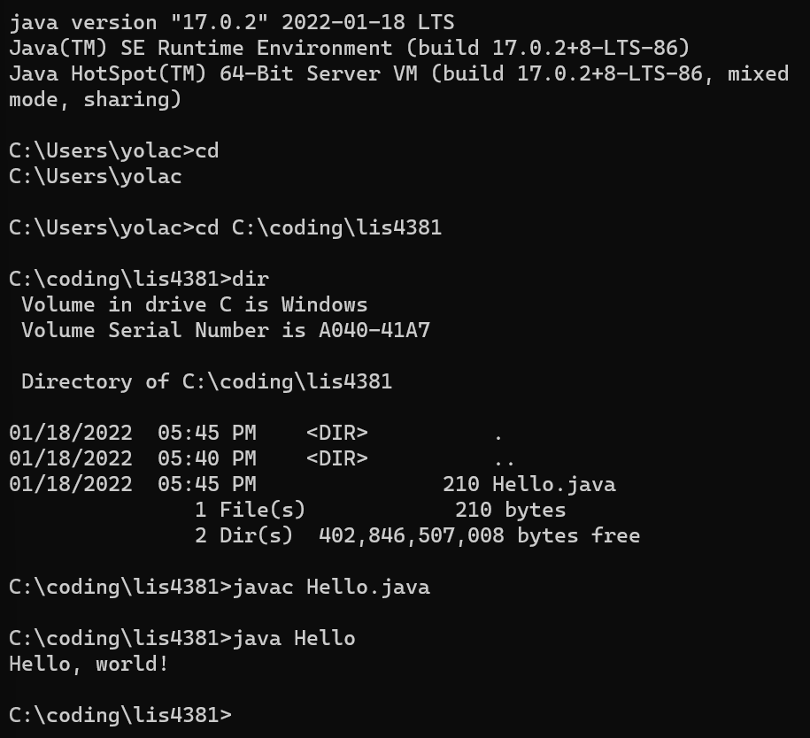
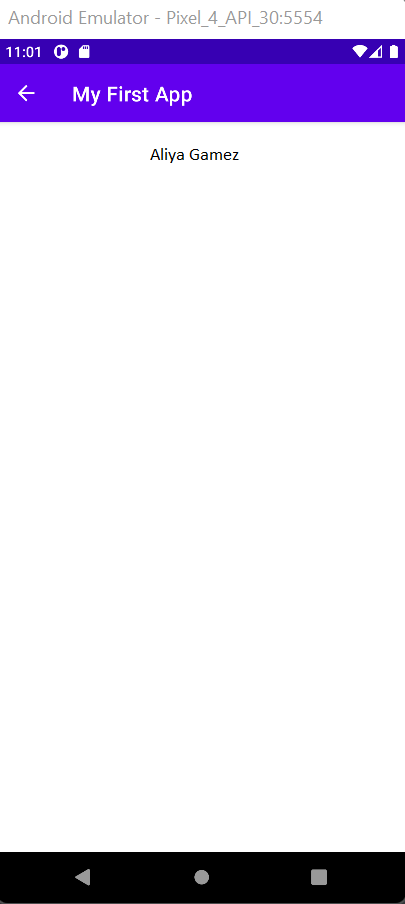
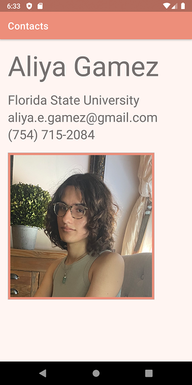

# LIS4331 - Advanced Mobile Web Application Development

## Aliya Gamez

### Assignment 1 Requirements:

*Three Parts*

1. Distributed Version Control with Git and Bitbucket
2. Development Installations
3. Chapter Questions (Chs 1,2)

#### README.md file should include the following items:

1. Screenshot of JDK Java Hello
2. Screenshot of Android Studio My First App
3. Screenshot of Android Studio Contacts App
4. git commands w/short descriptions
5. Bitbucket repo links

#### Git commands w/short descriptions:

1. git init - create an empty git repository or reinitialize an existing one
2. git status - shows the working tree status
3. git add - add new file contents to the current index
4. git commit - record current changes to the repository
5. git push - update the files from local branch to remote repo
6. git pull - pull or download files from remote repo to local repo
7. git clone - clones a repository into a new directory

#### Assignment Screenshots:

| <b>Screenshot of JDK Java Hello</b> |
| -- |
|  |

 

| <b>Screenshot of Android Studio My First App</b> |
| -- |
|  |

 

| <b>Screenshot of Android Studio Contacts App</b> |
| -- |
|  |

 

#### Tutorial Links:

*Bitbucket Tutorial - Station Locations:*
[A1 Bitbucket Station Locations Tutorial Link](https://bitbucket.org/username/bitbucketstationlocations/ "Bitbucket Station Locations")

*Tutorial: Request to update a teammate's repository:*
[A1 My Team Quotes Tutorial Link](https://bitbucket.org/username/myteamquotes/ "My Team Quotes Tutorial")

## Deliverables

1. [LIS4331 Repo](https://bitbucket.org/aeg19h/lis4331/src/main/)
2. [LIS4381 Repo](https://bitbucket.org/aeg19h/lis4381/src/master/) 