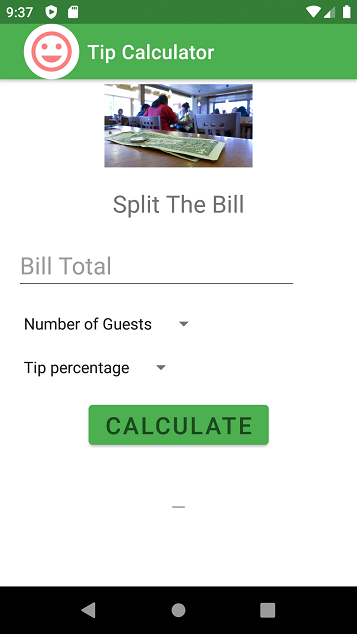
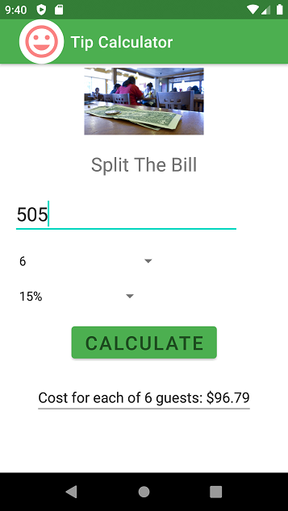
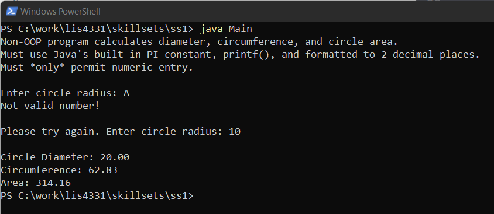
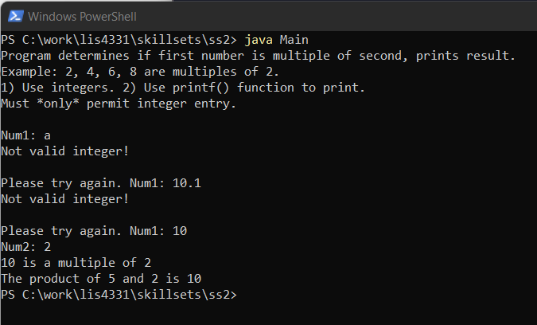
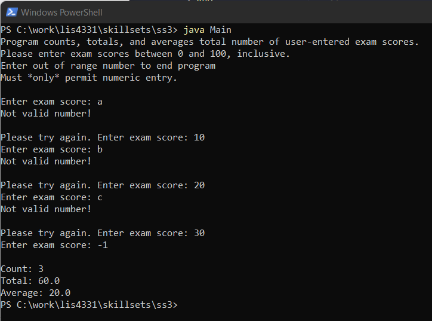

# LIS4331 - Advanced Mobile Web Application Development

## Aliya Gamez

### Assignment 2 Requirements:

*Three Parts*

1. Screenshots of backward-engineered application unpopulated and populated user interface
2. Research Android Studio theme and icon implementation.
3. Screenshots of Skillsets 1-3

#### Assignment Screenshots:

| <b>Screenshot of unpopulated user interface</b> | <b>Screenshot of populated user interface</b> |
| :--: | :--: |
|  |  |

 

#### Skillset Screenshots:

| <b>Screenshot of SS1 - Java: Non-OOP Circle</b> |
| -- |
|  |

| <b>Screenshot of SS2 - Java: Multiple Number</b> |
| -- |
|  |

| <b>Screenshot of SS3 - Java: Nested Structures 2</b> |
| -- |
|  |

 

#### Assignment Deliverables

1. [LIS4331 Repo](https://bitbucket.org/aeg19h/lis4331/src/main/)
2. [LIS4381 Repo](https://bitbucket.org/aeg19h/lis4381/src/master/)

