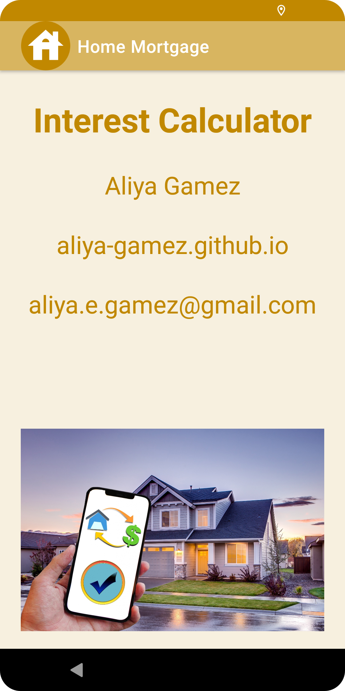
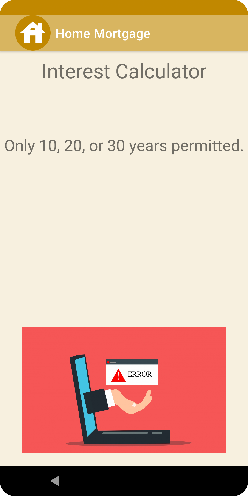
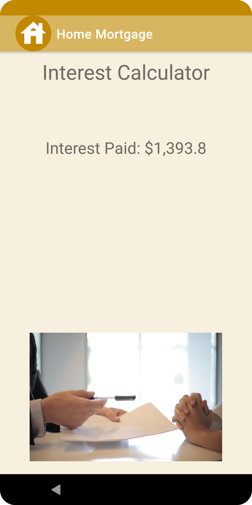
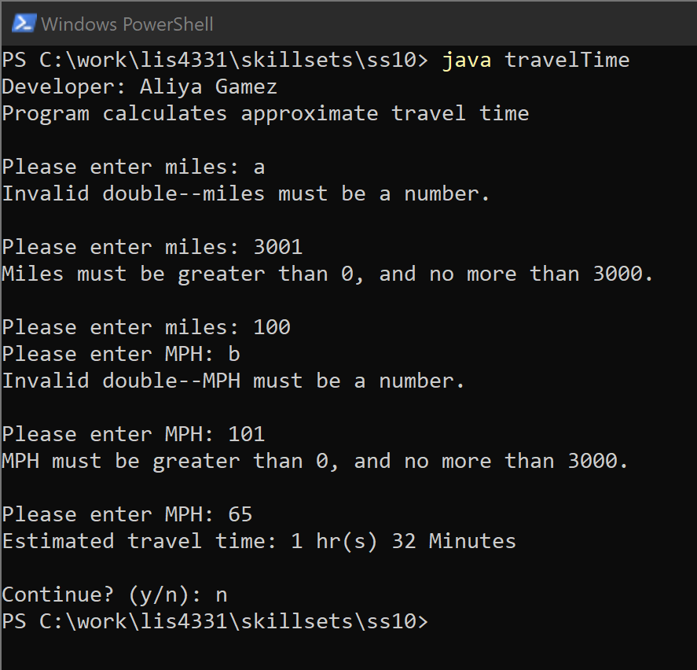
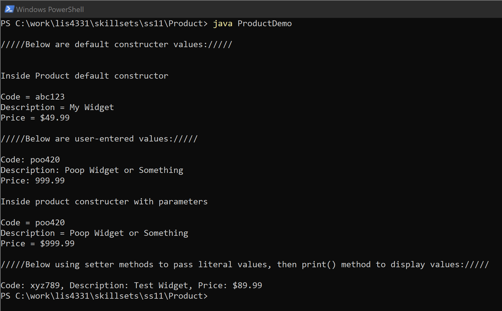
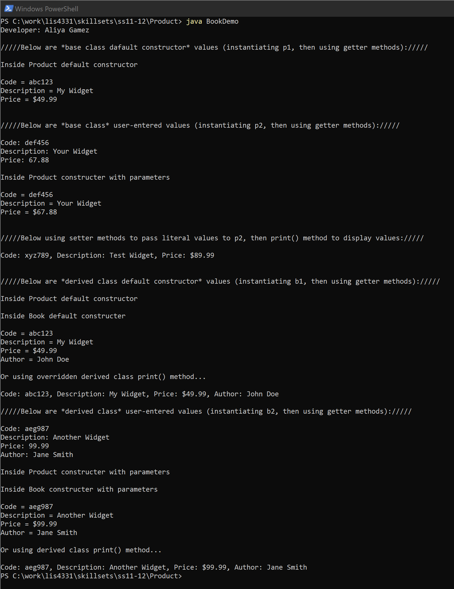

# LIS4331 - Advanced Mobile Web Application Development

## Aliya Gamez

### Assignment 4 Requirements:

*Four Parts*

1. Reverse-enginner "Ch 11 Mortgage" tutorial in course textbook
2. Reverse-enginner Interest Calculator app, using persistent data, aligning widgets, background color and display launcher icon.
3. Screenshots of running application's splash screen, main screen, invalid and valid screens with appopriate image change.
4. Screenshots of skillsets 10-12.

#### Assignment Screenshots:

| <b>Screenshot of splash screen</b> | <b>Screenshot of main screen</b> |
| :--: | :--: |
|  |  |

| <b>Screenshot of invalid input</b> | <b>Screenshot of valid input</b> |
| :--: | :--: |
|  |  |

#### Skillset Screenshots:

| <b>Screenshot of SS10 - Java: Travel Time</b> |
| -- |
|  |

| <b>Screenshot of SS11 - Java: Product Class</b> |
| -- |
|  |

| <b>Screenshot of SS12 - Java: Book Inherits Product Class</b> |
| -- |
|  |

#### Assignment Deliverables

1. [LIS4331 Repo](https://bitbucket.org/aeg19h/lis4331/src/main/)
2. [LIS4381 Repo](https://bitbucket.org/aeg19h/lis4381/src/master/)

