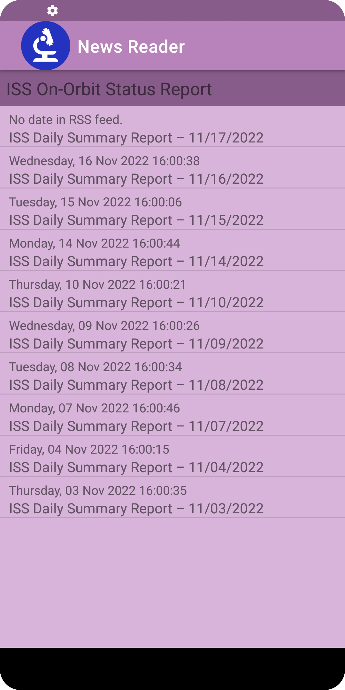
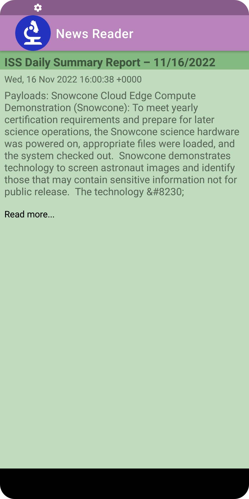
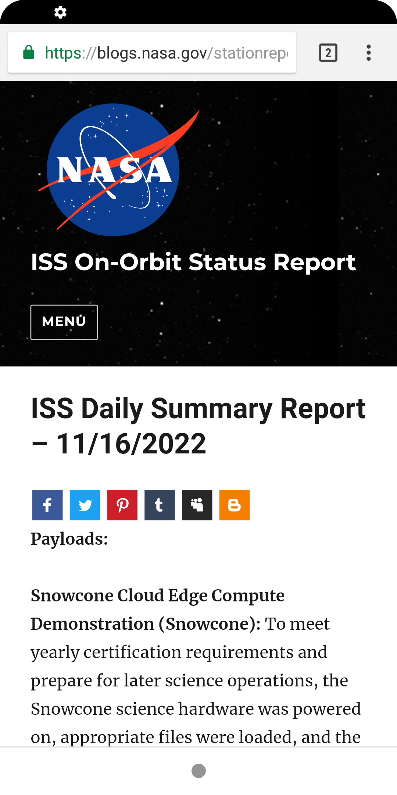
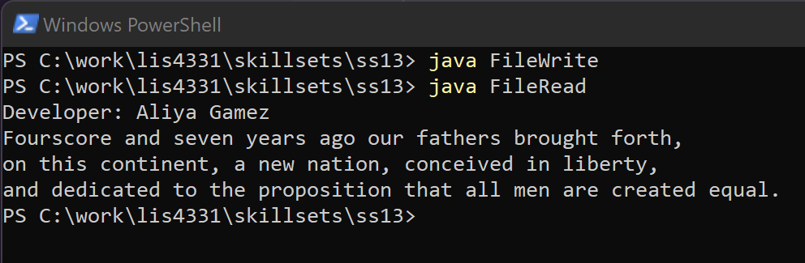
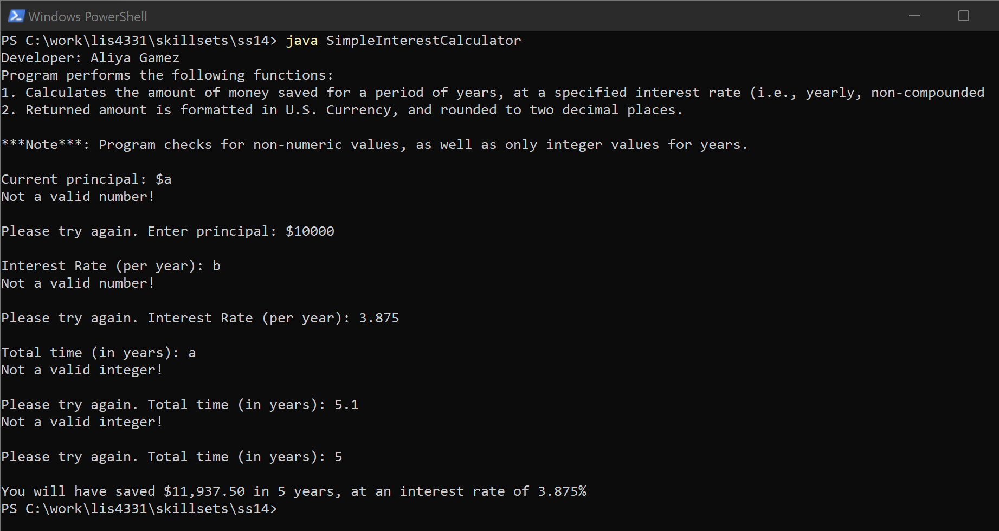
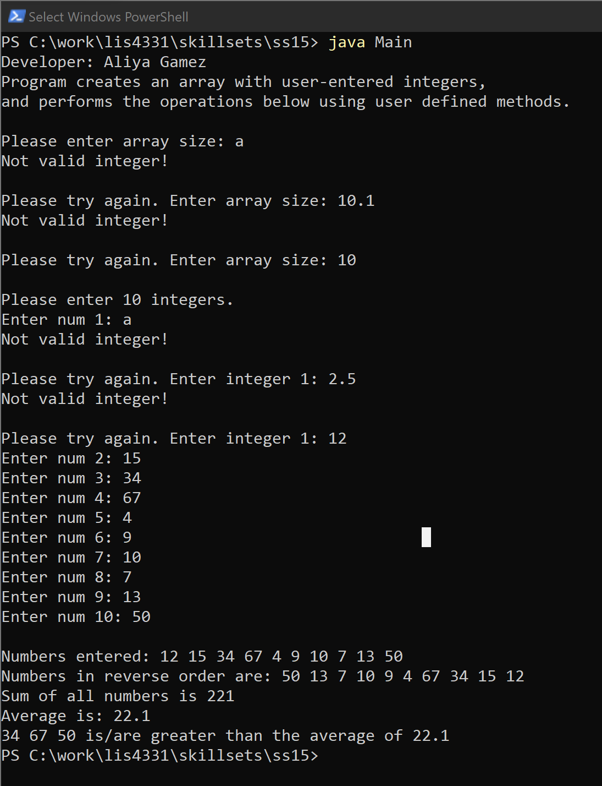

# LIS4331 - Advanced Mobile Web Application Development

## Aliya Gamez

### Assignment 5 Requirements:

*Four Parts*

1. Create a RSS Feed app.
2. Includes main screen with app title and articles.
3. Includes custom RSS feed, icon and colors.
4. Screenshots of skillsets 13-15.

#### Assignment Screenshots:

| <b>Items Activity</b> | <b>Item Activity</b> | <b>Read More...</b> |
| :--: | :--: | :--: |
|  |  |  |

#### Skillset Screenshots:

| <b>Screenshot of SS13 - Java: Write/Read File</b> |
| -- |
|  |

| <b>Screenshot of SS14 - Java: Simple Interest Calculator</b> |
| -- |
|  |

| <b>Screenshot of SS15 - Java: Array Demo Using Methods</b> |
| -- |
|  |

#### Assignment Deliverables

1. [LIS4331 Repo](https://bitbucket.org/aeg19h/lis4331/src/main/)
2. [LIS4381 Repo](https://bitbucket.org/aeg19h/lis4381/src/master/)
3. 

