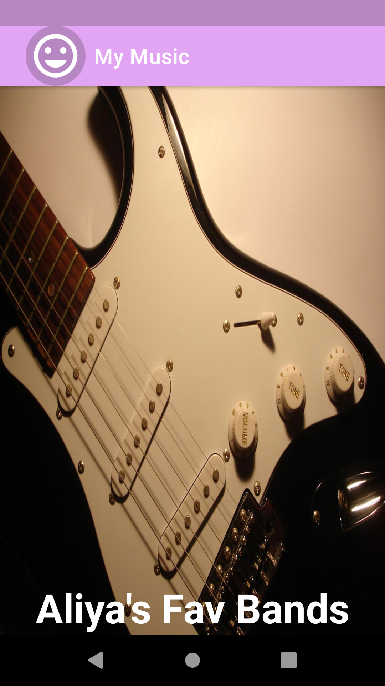
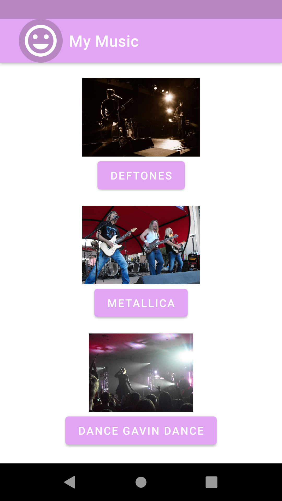
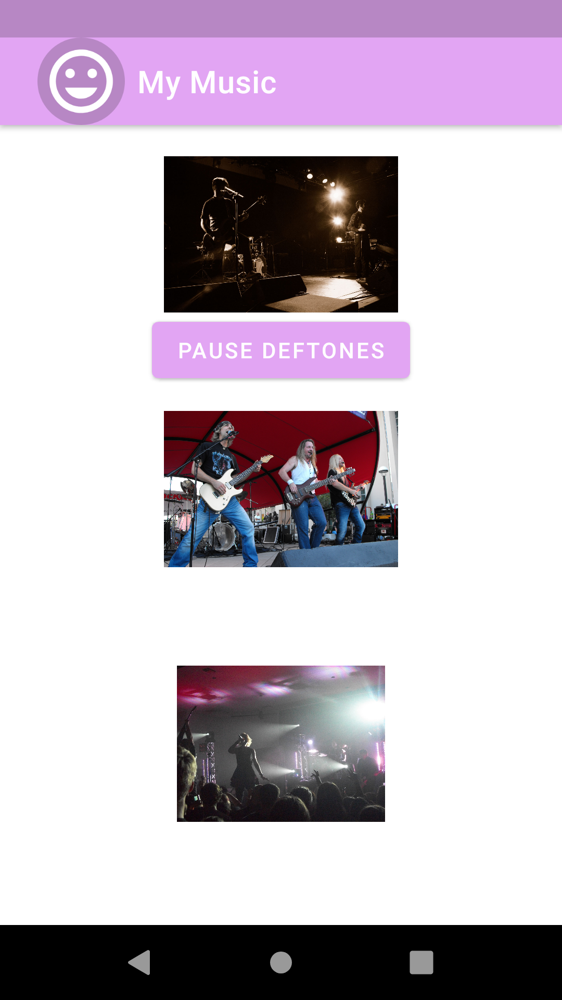
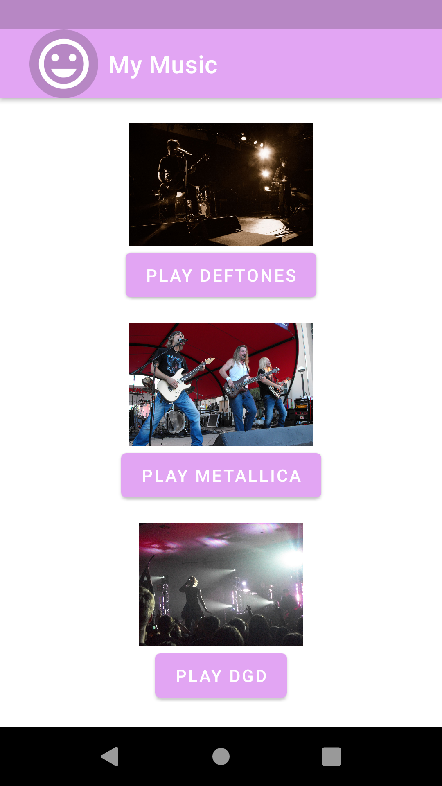
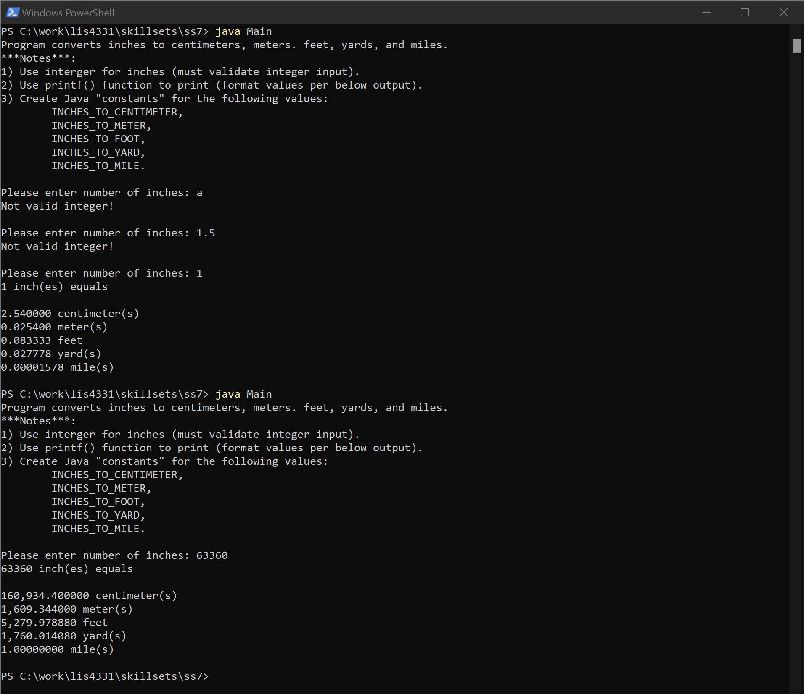
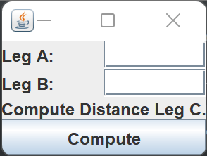
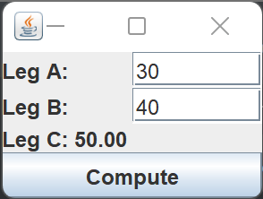
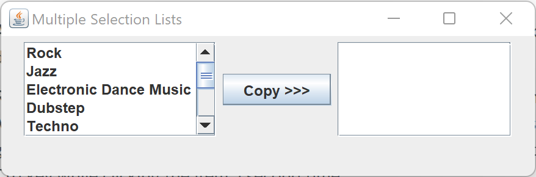
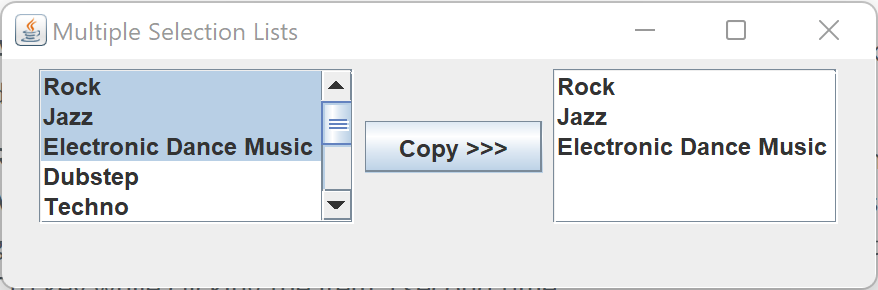

# LIS4331 - Advanced Mobile Web Application Development

## Aliya Gamez

### Project 1 Requirements:

*Four Parts*

1. Reverse-engineer "Ch 6 Aloha Music" tutorial in course textbook
2. Reverse-engineer project screenshots, using own (public domain) images, titles, text, media. Include background color and display launcher icon.
3. Screenshots of running application's splash, opening, play and paused screen.
4. Screenshots of skillsets 7-9.

#### Project Screenshots:

| <b>Screenshot of splash screen</b> | <b>Screenshot of opening screen</b> |
| :--: | :--: |
|  |  |

| <b>Screenshot of playing screen</b> | <b>Screenshot of paused screen</b> |
| :--: | :--: |
|  |  |

#### Skillset Screenshots:

| <b>Screenshot of SS7 - Java: Measurement Conversion</b> |
| -- |
|  |

| <b>Screenshot of SS8 - Java: Distance Calculator (GUI)</b> |
| -- |

| <i>Unpopulated</i> |
| -- |
|  |

| <i>Populated</i> |
| -- |
|  |

| <b>Screenshot of SS9 - Java: Multiple Selection Lists (GUI)</b> |
| -- |

| <i>Unselected List</i> |
| -- |
|  |

| <i>Single Interval Selection</i> |
| -- |
|  |

| <i>Multiple Interval Selection</i> |
| -- |
|  |

#### Project Deliverables

1. [LIS4331 Repo](https://bitbucket.org/aeg19h/lis4331/src/main/)
2. [LIS4381 Repo](https://bitbucket.org/aeg19h/lis4381/src/master/)

