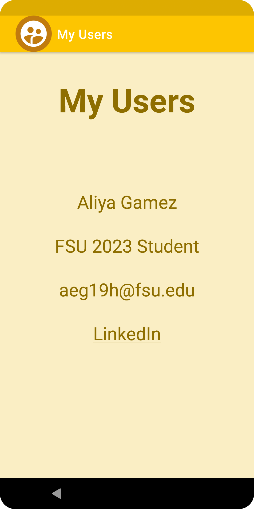
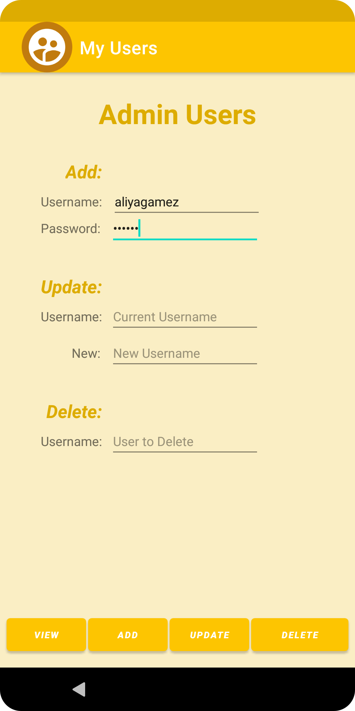
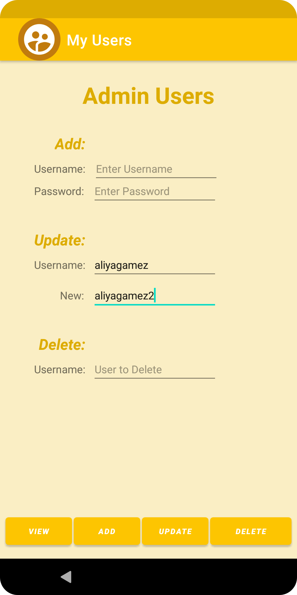
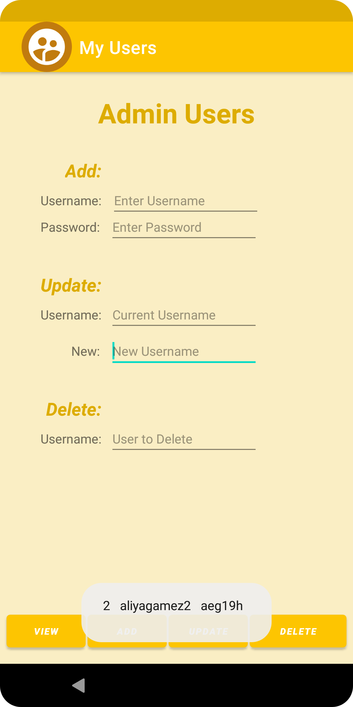
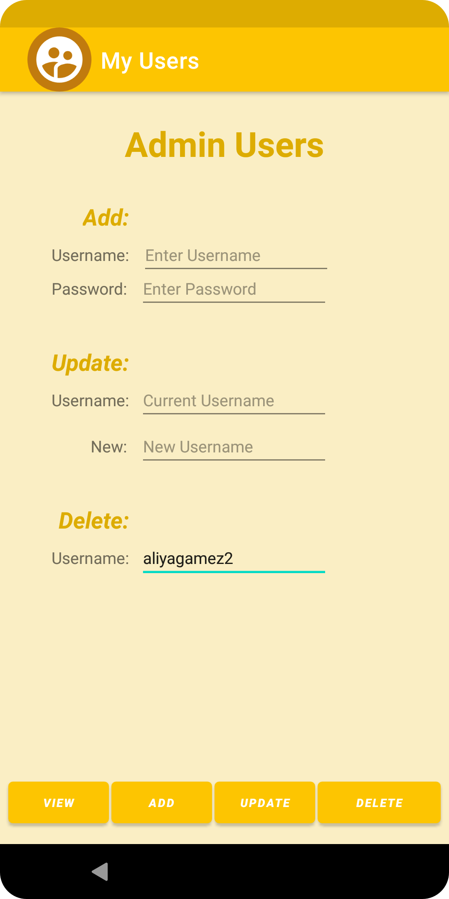

# LIS4331 - Advanced Mobile Web Application Development

## Aliya Gamez

### Project 2 Requirements:

*Three Parts*

1. Read through (“Introduction to Databases”) and backward-enginner photo requirements.
2. Include splash screen, use persistent data: SQLite database, insert at least 5 users, must add custom colors and icon.
3. Screenshots of splash, add, update, view and delete user screens.

#### Project Screenshots:

| <b>Splash Screen</b> | <b>Add User</b> | <b>Update User</b>
| :--: | :--: | :--: |
|  |  | 

| <b>View User</b> | <b>Delete User</b> |
| :--: | :--: |
|  |  |

#### Project Deliverables

1. [LIS4331 Repo](https://bitbucket.org/aeg19h/lis4331/src/main/)
2. [LIS4381 Repo](https://bitbucket.org/aeg19h/lis4381/src/master/)
3. 

